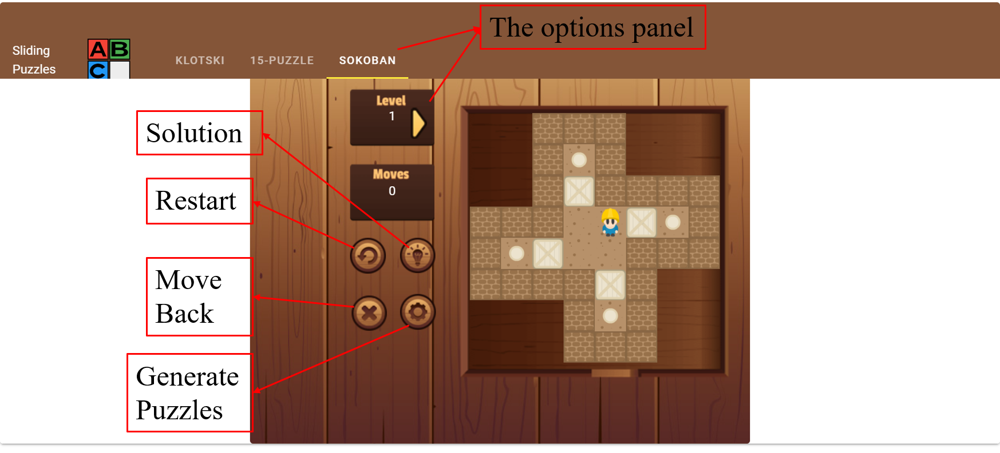
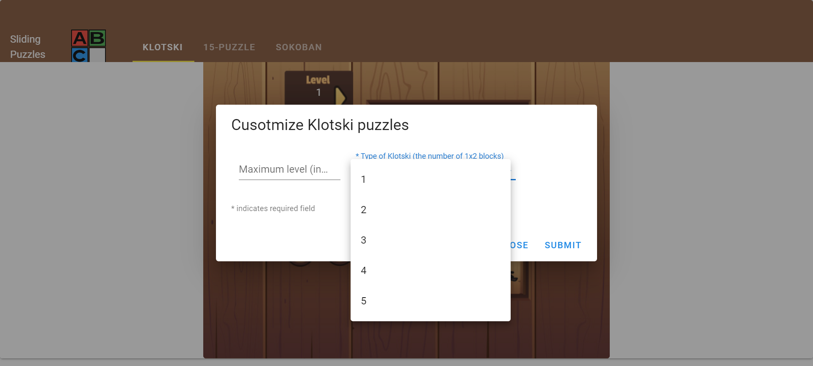
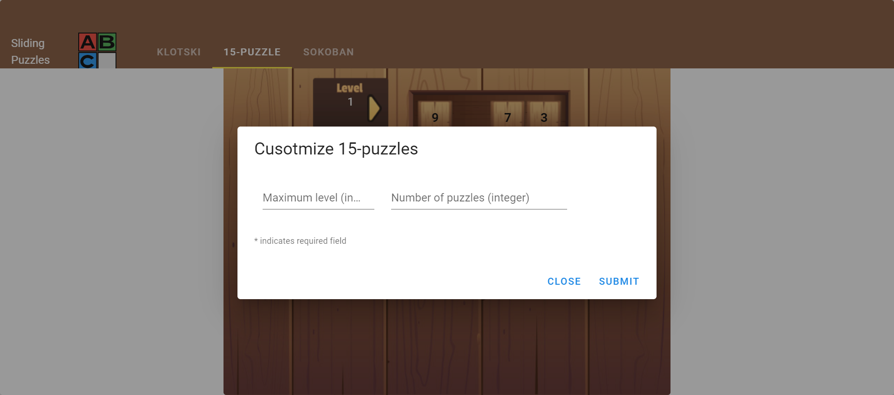
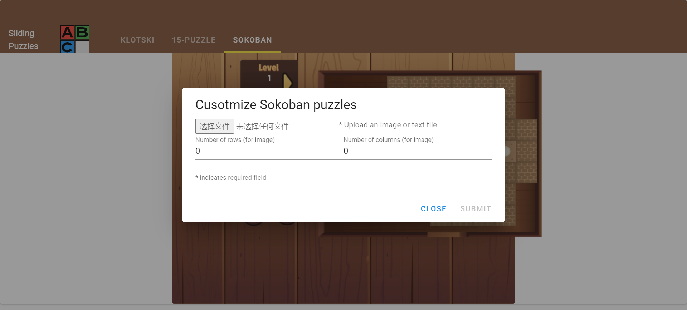

### A Game Generator for Sliding Puzzles

---

#### 1. Overview

This is an instruction manual for compiling and running the game generator. 

There are two main folders: Game_framework and Algorithms. The former one is the integrated web app, while the latter one includes the back-end algorithms for generating three kinds of sliding puzzles: Klotski, 15-puzzle, and Sokoban. 

#### 2. Game Framework

The game framework consists of the server end and the client end. To run the web app, you need to download the following tools to build the environment:

- Node.js: https://nodejs.org/en/download/
- Vue.js: https://vuejs.org/v2/guide/installation.html

After constructing the environment, you can run the server end by the command:

```
# under the Game_framework folder 
$ npm run dev
```

Then start the client end by the command:

```
# under the my-app floder
$ npm run serve
```

If there are some problems on starting the server or client, you may follow the following steps: 

1. Delete two folders: ./Game_framework/node_modules and ./Game_framework/my-app/node_modules

2. Under ./Game_framework

   ```
   $ npm install
   $ npm i express expres
   $ npm install express-fileupload
   $ npm install cors
   ```

3. Under ./Game_framework/my-app

   ```
   $ npm install
   $ npm install --save axios
   ```

4. Start the server and client end

   ```
   # under the Game_framework folder 
   $ npm run dev
   # under the my-app floder
   $ npm run serve
   ```

After starting the server and client ends, you can open the web app by the link http://localhost:8080/ on the web browser (recommended Chrome). As a result, you will see the front-end interface as following:



Users can switch among three kinds of sliding puzzles. For each puzzle, there is a panel for users to change the levels. Different levels have different solutions. And the move panel shows how many steps the player has used. Besides, there are some basic functionalities under the move panel. Users can undo or reverse the current step by clicking the first button. The light button denotes solving the puzzle in an optimal way automatically. And clicking the cross button can restart the game. The last setting button pops up an interface for the users to customize some properties and generate new sliding puzzles. 

**To generate Klotski puzzles:**

Click the setting button. Input the maximum number of levels/steps and choose the type of Klotski puzzle in terms of the number of 1x2 blocks. Let’s say the maximum level is 123 and the type is 2. Then click submit, and you will get the generated puzzles with 123-step optimal solutions very soon. And each puzzle has two 1x2 blocks. 



**To generate 15-puzzles:**

Click the setting button and input the maximum level and the number of puzzles. Let’s say 10 and 12. You can see the system creates 12 puzzles, and the optimal solution is 10 steps. 



**To generate Sokoban puzzles:**

You can upload either a text or image file (examples in the Sokoban_input folder) that represents the positions of boxes and destinations. If the input is a text file like the input.txt, the system will directly convert it into a numerical matrix, which is a standard input format of the pivotal algorithm. However, if the input is an image like a hand-painted puzzle, users need to input the numbers of row and column of the game board. And the back-end image interpreter will process the image and then convert it into a standard numerical matrix. Then the pivotal algorithm will conduct an exhaustive search and generate some Sokoban puzzles with optimal solutions. You can input the test image file, and there are 8 rows and 8 columns. It will take a relatively long time to process the image and recognize the patterns. Finally, the generated Sokoban puzzles will be automatically rendered. 



#### 3. Algorithms

There are 3 algorithms implemented in C++ for generating those 3 kinds of sliding puzzles, respectively. To generate different sliding puzzles in JSON format, you can compile the corresponding C++ codes by g++ commands. If you want to compile them on Windows, you can use Visual Studio or download MinGW Installer that supports g++ commands. 

**For Klotski.cpp:**

```
# under the ./Algorithms/Klotski folder 
$ g++ -o Klotski.exe -O3 Klotski.cpp
```

Then you will get the executable file. Then run the file by inputting two parameters:

```
$ ./Klotski.exe [Maximum level] [type of Klotski puzzle]
```

Finally, you will get the output in JSON format on the console.

**For 15puzzle.cpp:**

```
# under the ./Algorithms/15_puzzle folder 
$ g++ -o 15puzzle.exe -O3 15puzzle.cpp
```

Then you will get the executable file. Then run the file by inputting two parameters:

```
$ ./15puzzle.exe [Maximum level] [number of 15-puzzles]
```

Finally, you will get the output in JSON format on the console.

**For Sokoban.cpp:**

Since it utilizes the open-source library OpenCV, you need to install the OpenCV for C++ with the help of this link: https://www.deciphertechnic.com/install-opencv-with-visual-studio/. Then you can compile the C++ codes and encapsulate them as an executable file in Visual Studio following the tutorial: https://docs.microsoft.com/en-us/cpp/ide/walkthrough-deploying-your-program-cpp?view=msvc-160. 

Then you can run the back-end program to generate Sokoban puzzles by the command:

```
$ ./Sokoban.exe [type of input: 0-text, 1-image] [path of input] [number of rows] [number of columns]
```

Finally,  you will get the output in JSON format on the console.

Note: All the algorithms have been encapsulated as executable files under the folder Game_framework. 
